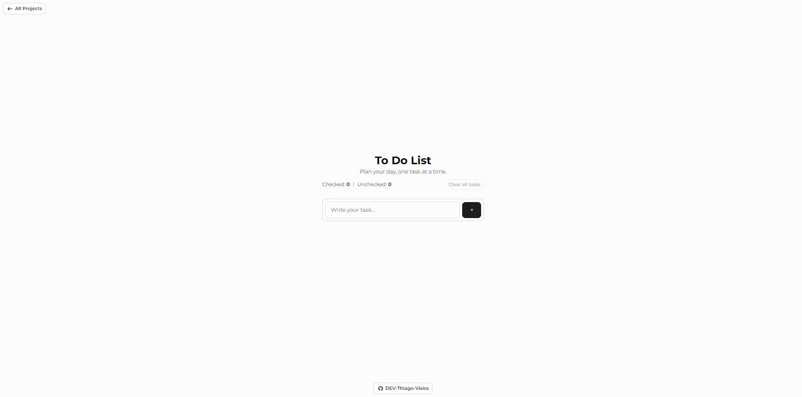
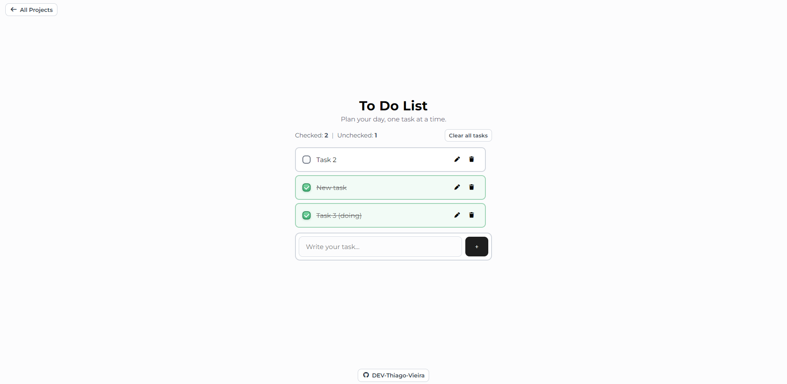

# To Do List

A simple daily task manager built as part of the Project Calendar challenge.

## Live

- ✅ To Do List: https://micro-projects-ebon.vercel.app/March/Day%2014/index.html
- 🌐 Project Calendar: https://micro-projects-ebon.vercel.app/index.html

## Core Features

- 📝 Add, edit, check, and delete tasks
- ⬆️ New and unchecked tasks stay above checked tasks
- 🎉 Completion toast feedback
- 🛡️ Delete and clear-all confirmation modals
- 💾 Tasks saved in localStorage

## Previews

