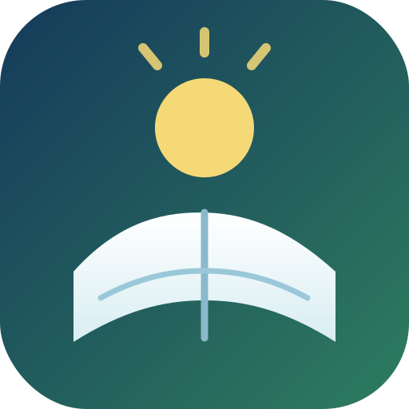

# 
# Novel Day

## Overview
Novel Day is a project designed to help writers practice manual skills without any AI assistance during the writing process. The app focuses on providing a customizable and fast writing experience, while also allowing users to automatically check grammar using GPT. Users can quickly adjust tests, and the backend is responsible for storing data and managing accounts.

This project is intended to be affordable and primarily for personal use, but it has the potential to scale into a larger platform for automating chapter publication to other platforms. At its core, Novel Day aims to assist users in achieving their writing goals, offering feedback, automatic proofreading, and all the conveniences a writer might need. Additionally, the site will support a simple framework for planning writing projects.

## Features
- Track your daily writing progress
- Plan your writing schedule
- Write and organize your novel
- Automatic grammar checking with GPT
- Feedback and proofreading tools
- Data storage and account management

## Technologies Used
- HTML
- CSS
- JavaScript
- Node.js

## Future Plans
- Expand to support automated chapter publishing to other platforms
- Develop a simple planning framework for writers

---
For personal use, but designed to grow with your writing ambitions.
